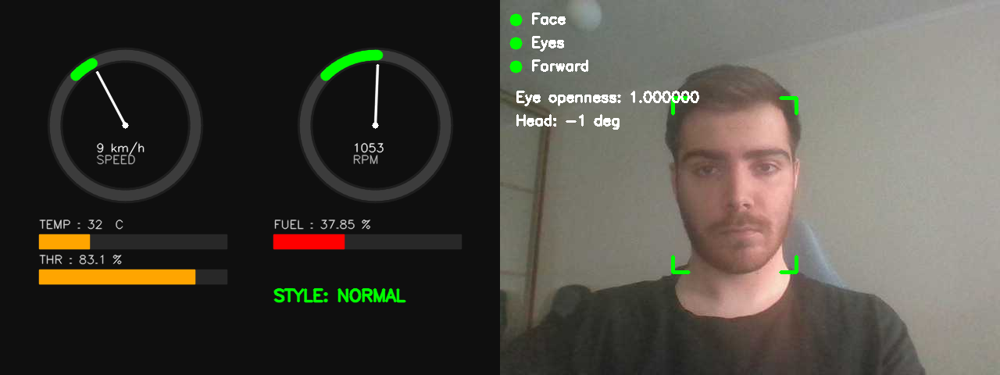

# Real Car ADAS Monitor

Система мониторинга водителя (DMS, Driver Monitoring System) и телеметрии автомобиля в реальном времени. Объединяет классификатор стиля вождения на основе OBD-данных с моделью компьютерного зрения для отслеживания сонливости и отвлечения водителя.

---

## Описание системы

`real-car-adas-monitor` — это прототип системы мониторинга, реализованный на C++. Система одновременно решает две задачи:

1. **Классификация стиля вождения** по данным OBD. На основе телеметрии (скорость, обороты двигателя, положение дроссельной заслонки, температура охлаждающей жидкости, уровень топлива, температура впускного воздуха) ONNX-модель относит поведение водителя к одному из трёх классов: `SLOW`, `NORMAL` или `AGGRESSIVE`.
2. **Мониторинг состояния водителя по видео** (DMS). Детекция лица с помощью DNN (Caffe-модель `res10 SSD`), оценка открытости глаз через каскад Хаара. На основе этого формируются алерты `DROWSY` (сонливость) и `DISTRACTED` (отвлечение внимания).

Оба потока работают параллельно (через `std::jthread`): OBD-поток парсит CSV и классифицирует записи, видеопоток захватывает кадры с камеры и рисует HUD. Результат выводится в единый двухсекционный кадр (дашборд + камера), сохраняется в MP4-файл и логируется.

---

## Стек технологий

| Компонент | Версия |
|---|---|
| C++ | C++20 | 
| CMake | ≥ 3.10 |
| OpenCV | 4.x |
| ONNX Runtime | ≥ 1.x (`/opt/onnxruntime`) |
| Google Test | v1.14.0 (FetchContent) |
| Doxygen | — |

---

## Сборка

## Зависимости

```bash
# Ubuntu 22.04
sudo apt-get update
sudo apt-get upgrate
sudo requirements.sh
```

## Команды сборки

```bash
# 1. Клонировать репозиторий
cd ~/ && git clone <repo_url> real-car-adas-monitor
cd real-car-adas-monitor

# 2. Сконфигурировать CMake
cmake -S . -B build \
    -DONNXRUNTIME_ROOT=/opt/onnxruntime

# 3. Собрать
cmake --build build -j$(nproc)
```

После успешной сборки появятся:
- `build/RealCarMonitor` — основной исполняемый файл;
- `build/RunTests` — набор модульных тестов.

### Запуск тестов

```bash
cd build && ctest --output-on-failure
```

---

## Запуск

1. Убедитесь, что в рабочей директории присутствуют файлы данных телеметрии и обученных моделей:
```
real-car-adas-monitor/
├── data/
│   └── dataset.csv            
├── models/
│   ├── driver_classifier.onnx
│   ├── normalization_params.json
│   ├── deploy.prototxt.txt
│   ├── res10_300x300_ssd_iter_140000.caffemodel
│   └── haarcascade_eye.xml
```

2. По умолчанию система читает кадры из `/mnt/c/frame.jpg` (определяется макросом `INPUT_FRAMES_FROM_MND_FOLDER` в `src/env.h`). Чтобы использовать веб-камеру — закомментируйте этот `#define` в `src/env.h`.

3. Запуск основного сценария:

```bash
./build/RealCarMonitor
```

## Управление в окне

| Клавиша | Действие |
|---|---|
| `q` / `Q` | Завершение работы |
| `Space` | Пауза / продолжение |
| `s` / `S` | Сделать скриншот → `output/screenshot.png` |

Выходные данные:
- `output/result_situation2.mp4` — записанное видео (10 FPS, 1280×480);
- `output/dms_alerts.log` — лог всех сработавших предупреждений;
- `output/frames/` — отдельные кадры (если включён `PRINT_FRAMES`).

---

## Скриншот работающей системы



[Открыть видео работы системы](output/result_situation2.mp4)

---

## Структура проекта

```
real-car-adas-monitor/
├── CMakeLists.txt          # Конфигурация сборки
├── Doxyfile                # Конфигурация Doxygen
├── README.md               # Этот файл
├── data/
│   ├── dataset.csv         # Датасет OBD
│   └── generate_obd_data.py
├── models/                 # ONNX, Caffe, Haar модели
│   ├── driver_classifier.onnx
│   ├── normalization_params.json
│   ├── deploy.prototxt.txt
│   ├── res10_300x300_ssd_iter_140000.caffemodel
│   └── haarcascade_eye.xml
├── src/
│   ├── main.cpp            # Точка входа
│   ├── common.h            # Общие структуры (OBDRecord, LabelType)
│   ├── env.h               # Пути и константы
│   ├── obd_parser.{h,cpp}  # CSV-парсер OBD
│   ├── onnx_classifier.{h,cpp}  # Классификатор стиля вождения
│   ├── dashboard.{h,cpp}   # Визуализация приборной панели
│   ├── dms_monitor.{h,cpp} # DMS: детекция лица/глаз
│   ├── dms_hud.{h,cpp}     # DMS: HUD-разметка
│   ├── stat_tool.h         # Сбор статистики
│   └── logger.h            # Логгер
├── tests/
│   ├── test_obd_parser.cpp
│   └── test_dms.cpp
└── output/                 # Результаты работы
    ├── result_situation2.mp4
    ├── dms_alerts.log
    └── architecture.md
```
---
